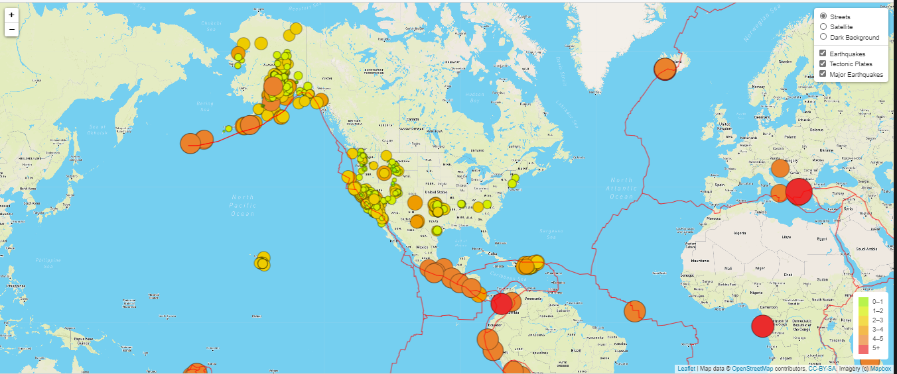

# Mapping_Earthquakes
Create a dynamic webpage about recent earthquakes around the world.
[Go to this folder to view the files](https://github.com/MonikaSData/Mapping_Earthquakes/tree/main/Earthquake_Challenge)

## Overview of Project
**Purpose:**
The purpose of this project is to visually show the differences between the magnitudes of earthquakes all over the world for the last seven days.

**Task:** 
To complete this project, we will use a URL for GeoJSON earthquake data from the USGS website and retrieve geographical coordinates and the magnitudes of earthquakes for the last seven days. Then we will add the data to a map.

**Approach:**
Using the JavaScript and the D3.js library to retrieve the coordinates and magnitudes of the earthquakes from the GeoJSON data.
Using the Leaflet library to plot the data on a Mapbox map through an API request and create interactivity for the earthquake data.

**Method:** Using GeoJSON, JavaScript, JQuery, Leaflet, HTML, CSS.

## Resources
- Data Source: [Mapbox_data](https://www.mapbox.com/); [Earthquake_data(last 7 days)](https://earthquake.usgs.gov/earthquakes/feed/v1.0/summary/all_week.geojson); [Major_earthquake_data(last 7 days &magnitute > 4.5)](https://earthquake.usgs.gov/earthquakes/feed/v1.0/summary/4.5_week.geojson); [Tectonic_plates](https://raw.githubusercontent.com/fraxen/tectonicplates/master/GeoJSON/PB2002_boundaries.json);
- Source Code: 
    [challenge_logic.js](Earthquake_Challenge/static/js/challenge_logic.js); [style.css](Earthquake_Challenge/static/css/style.css); [index.html](Earthquake_Challenge/index.html)
  
- Programming Languages: JavaScript; HTML; CSS
- Software: VS Code

## Results

The following webpage has been built as part of this project.

**Snapshot of final webpage**

